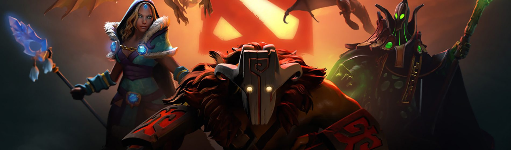
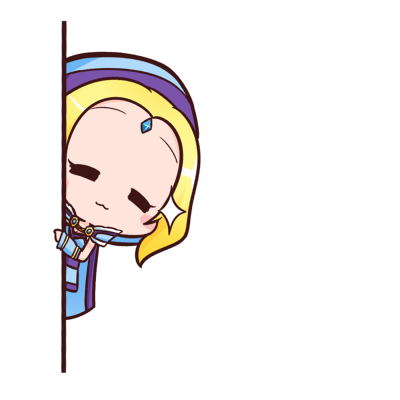
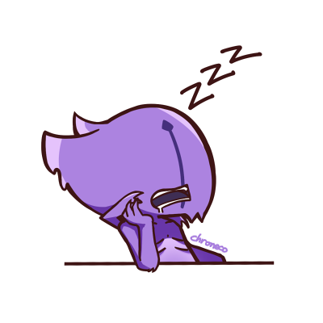
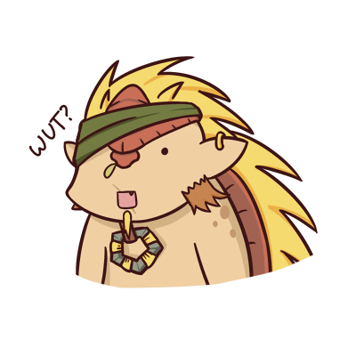

```{r setup, include=FALSE}
knitr::opts_chunk$set(echo = TRUE, 
                      fig.align = "center")

options(scipen = 999)
```

You know what's Dota right? DotA stands for `Defends of the Ancients`. Dota 2 is a multiplayer online battle arena (MOBA) video game developed and published by Valve. Dota 2 is played in matches between two teams (called `Radiant` and `Dire`) of five players, with each team occupying and defending their own separate base on the map. Each of the ten players independently controls a powerful character, known as a `hero`. A team wins by being the first to destroy the other team's `Ancient`, a large structure located within their base.


# Background {.tabset}
## Objective
This project is based on an old `Kaggle` competition. The training set consists of matches, for which all of the ingame events (like kills, item purchase etc.) as well as match outcomes are known. We are given only the first 5 minutes of each match and need to predict the likelihood of Radiant victory. You can found all the datasets and the competition [here](https://www.kaggle.com/c/dota-2-prediction/overview). As you can see from the kaggle page, there's only 2 notebooks and it doesn't tell that much. So we're going to build the prediction from scratch.

## Libraries
You can load the package into your workspace using the `library()` function

```{r warning=FALSE, message=FALSE}
library(dplyr)
library(stringr)
library(rjson)
library(rsample)
library(data.table)
library(dummies)
library(fastDummies)
library(tokenizers)
library(caret)
```

# Let's begin



## Data Import
The `Kaggle` provide 5 datasets; test, train, hero_names, item_ids, and submission example. since i'm not gonna submit my prediction to the late competition, i don't need to load the submission. The train dataset contain 409794 obs and 103 variables (one target label) so we have 102 variables to predict which team is winning. The test contain 71772 obs and we also did not need that because i'm not submit my result. 
```{r}
train1 <- read.csv("train.csv")
hero.name <- fromJSON(file = "hero_names.json")
item.id <- fromJSON(file = "item_ids.json")
item.id <- as.data.frame(t(as.matrix(item.id)))
item.id <- item.id %>% mutate(item.label = rownames(item.id))
```

# Data Wrangling / Pre-process / Data Preparation
## Exploratory Data Analysis
```{r}
glimpse(train1)
```


If you have no idea what those variable is all about, here's the variable's descriptions:
- `match_id`: unique id for every match   
- *note* r1-r5 mean player 1-5 in team Radiant, and d1-d5 mean player 1-5 in team Dire   
- `r1_hero` : player's hero (mapping can be found in hero_names.json)   
- `r1_level` : maximum hero level reached (by the first 5 minutes of the game)   
- `r1_xp` : maximum experience gained   
- `r1_gold` : amount of gold earned   
- `r1_lh` : last hits, number of creeps killed   
- `r1_kills` : number of players killed   
- `r1_deaths` : the number of deaths for the hero   
- `r1_items` : the number of items purchased   
- *note:* If the "first blood" event did not have time to occur in the first 5 minutes, the column contains a missing value.   
- `first_blood_time` : time for the first blood (first_blood = first death/kill in the game)   
- `first_blood_team` : the team that committed the first blood (0 - Radiant, 1 - Dire)   
- `first_blood_player1` : index of player who got the kill   
- `first_blood_player2` : index of player who got killed   
- *note:* Features for both teams (prefixes radiant_ and dire_ ):   
- `radiant_bottle_time` : the time the team first purchased the item "bottle"   
- `radiant_courier_time` : acquisition time of the "courier" item   
- `radiant_flying_courier_time` : acquisition time of the "flying_courier" item   
- `radiant_tpscroll_count` : the number of tpscroll items bought in the first 5 minutes   
- `radiant_boots_count` : the number of "boots" for the team in the first 5 minutes   
- `radiant_ward_observer_count` : the number of "ward_observer" items   
- `radiant_ward_sentry_count` : the number of "ward_sentry" items   
- `radiant_first_ward_time` : the time for the first placed ward for the team   
- `radiant_win` : True, if the Radiant team won, False - otherwise (this is or target variable)   

There's so much to do with data wrangling. as you can see from the glimpse above, there's lots of variables that seems redundant. we'll convert them to as few as possible without reducing its meaning

```{r}
# i found 1 row in column first_blood_player_2 column contain -1. maybe its a typo. i'll change it to 0
train1$first_blood_player2[train1$first_blood_player2 == -1] <- 0
i <- c(1,2,9,10,17,18,25,26,33,34,41,42,49,50,57,58,65,66,73,74,81,83,84,85)
train1.edit <- train1
# change some column to factor
train1.edit[,i] <- lapply(train1.edit[,i], as.factor)
# i also found missing value in target vaiable (only 8 rows). I remove that rows and drop the factor levels
train1.edit <- train1.edit[!(train1.edit$radiant_win==""),] %>% droplevels()
```

```{r}
# check proportion of target variable. make sure its evenly distributed
table(train1.edit$radiant_win) %>% prop.table()
```
it's good to go

The dataset is way too large for my potato laptop, so i need to split it only to 4k obs
```{r}
set.seed(1502)
train1.edit <- sample_n(train1.edit, 4000)
```

## Feature Engineering

### Summarize Redundant Variables

I'll combine some numeric data per team
```{r}
# r1-r5 stands for radiant player 1-5, and d1-d5 for dire player 1-5
train1.edit <- train1.edit %>%
  mutate(
    radiant_gold = as.integer(r1_gold + r2_gold + r3_gold + r4_gold + r5_gold),
    radiant_xp = as.integer(r1_xp + r2_xp + r3_xp + r4_xp + r5_xp),
    radiant_level = as.integer(r1_level + r2_level + r3_level + r4_level + r5_level),
    radiant_lh = as.integer(r1_lh + r2_lh + r3_lh + r4_lh + r5_lh),
    radiant_kills = as.integer(r1_kills + r2_kills + r3_kills + r4_kills + r5_kills),
    radiant_deaths = as.integer(r1_deaths + r2_deaths + r3_deaths + r4_deaths + r5_deaths),
    dire_gold = as.integer(d1_gold + d2_gold + d3_gold + d4_gold + d5_gold),
    dire_xp = as.integer(d1_xp + d2_xp + d3_xp + d4_xp + d5_xp),
    dire_level = as.integer(d1_level + d2_level + d3_level + d4_level + d5_level),
    dire_lh = as.integer(d1_lh + d2_lh + d3_lh + d4_lh + d5_lh),
    dire_kills = as.integer(d1_kills + d2_kills + d3_kills + d4_kills + d5_kills),
    dire_deaths = as.integer(d1_deaths + d2_deaths + d3_deaths + d4_deaths + d5_deaths)
  )

train1x <- train1.edit[,1:81] %>%
  select_if(Negate(is.integer))

train1.new <- cbind(train1x, train1.edit[,82:115])
# +90 means i add additional 90 seconds to the time variable to avoid negative occurrences in data. 
# In dota2 game, the game actually start from -1.30 minutes for preparation. 
# The minus in raw data tells the event happen before game started in 00.00
train1.new[,c(22,26,27,28,33,34,35,36,41,42)] <- train1.new[,c(22,26,27,28,33,34,35,36,41,42)] + 90

```

### Convert Time Attribut to Categories

NA in time variable value is kinda tricky. if you fill NA with 0 it'll assume the event occurs in second 0. we don't want it to happen. I convert all the time (second in this case) variable to categoric value. The additional levels are meant to NA value, indiciting certain events do not happen
```{r}
labels.time <- c("1","2","3","4")

train1.new <- train1.new %>% mutate(
  first.blood.time = cut(
    train1.new$first_blood_time,
    breaks = c(-Inf,103,171,232,Inf),
    labels = labels.time),
  radiant.bottle.time = cut(
    train1.new$radiant_bottle_time,
    breaks = c(-Inf, 166, 219, 257, Inf),
    labels = labels.time),
  radiant.courier.time = cut(
    train1.new$radiant_courier_time,
    breaks = c(-Inf, 7, 16, 27, Inf),
    labels = labels.time),
  radiant.fly.courier.time = cut(
    train1.new$radiant_flying_courier_time,
    breaks = c(-Inf, 278, 301, 311, Inf),
    labels = labels.time),
  radiant.first.ward.time = cut(
    train1.new$radiant_first_ward_time,
    breaks = c(-Inf, 68, 90, 150, Inf),
    labels = labels.time),
  dire.bottle.time = cut(
    train1.new$dire_bottle_time,
    breaks = c(-Inf, 166, 219, 257, Inf),
    labels = labels.time),
  dire.courier.time = cut(
    train1.new$dire_courier_time,
    breaks = c(-Inf, 7, 16, 27, Inf),
    labels = labels.time),
  dire.fly.courier.time = cut(
    train1.new$dire_flying_courier_time,
    breaks = c(-Inf, 278, 301, 311, Inf),
    labels = labels.time),
  dire.first.ward.time = cut(
    train1.new$dire_first_ward_time,
    breaks = c(-Inf, 68, 90, 150, Inf),
    labels = labels.time)
  )

# In Dota terms, we know that the duration of the game are usually splitted into 3 terms: fast game, normal game, and late game. 
# I convert the game duration into 3 categories: fast for min ~ 42 minutes, normal for 42 ~ 49 minutes, and late for 50 ~ max minutes.
train1.new <- train1.new %>% mutate(
  duration.c = cut(
    train1.new$duration/60,
    breaks = c(-Inf, 42, 49, Inf),
    labels = c("fast","normal","late")
  )
)

```

Lets see if we correctly convert numeric value to factor
```{r}
boxplot(train1.new$first_blood_time~train1.new$first.blood.time, col = 3:6)
boxplot(train1.new$dire_bottle_time~train1.new$dire.bottle.time, col =3:6)
boxplot(train1.new$radiant_courier_time~train1.new$radiant.courier.time, col=3:6)
boxplot(train1.new$dire_first_ward_time~train1.new$dire.first.ward.time, col=3:6)
boxplot(train1.new$duration/60~train1.new$duration.c, col =3:5)
```


```{r}
#drop unused variable
train1.x <- train1.new %>% select(-c(22,26,27,28,33,34,35,36,41,42))
```


### Fill NA with New Value in Categoric
```{r}
# fill NA = 5 to time variable. Level 5 means the team doesn't do the 'things'
# its hard for me to say it in english so here's an example: if first.blood.time levels = 5, 
# it means that match doesn't have any first blood in the frst 5 minutes

train1.x[46:54] <- lapply(train1.x[46:54], function(x){
  x <- factor(x, exclude = NULL)
  levels(x)[is.na(levels(x))] <- "5"
  return(x)
})

## for first.blood.team NA, i'll fill "3", means that match  doesn't have any first blood in first 5 minutes
levels(train1.x$first_blood_team) <-  c(levels(train1.x$first_blood_team), "3")
train1.x$first_blood_team[which(is.na(train1.x$first_blood_team))] <-  "3"


## and for first.blood.player NA, i'll fill "10", means that team doesn't have any first blodd
train1.x[23:24] <- lapply(train1.x[23:24], function(x){
  x <- factor(x, exclude = NULL)
  levels(x)[is.na(levels(x))] <- "10"
  return(x)
})

```


### Normalization
We know that radiant/dire tp,boots,wards count have a different range with radiant/dire gold,exp,kills, etc. so we need to perform normalization in order to re-sclae them into one same range
```{r}
# Normalization function 
normalize <- function(x){
  return ( 
    (x - min(x))/(max(x) - min(x)) 
  )}

# select integer class data
int <- sapply(train1.x, class)=="integer"
# Perform normalization
train1.x[,int] <- lapply(train1.x[,int], normalize)
```


### Convert Hero used to its Roles Category
Now come the hardest part (for me). I actually spend a lot of time to figure out how we change hero to have fewer levels. Theres 117 heroes in Dota and this whole dataset using 115 of them. if we put 115 levels of factor i'm certanily sure it'll broken the model. Good thing the competition provide heroes detail in json data. I convert every used heroes per team per match to its roles.

```{r warning=FALSE}
# select used hero variable in main dataframe
hero.use <- train1.x[,grepl("_hero", names(train1.x))]
# convert list (from json) to dataframe
hero.df2 <- rbindlist(hero.name)
hero.df2$roles <- as.factor(hero.df2$roles)
# In dota2, hero roles are splitted to 9 categories: carry, disabler, durable, escape, initiator, jungler, nuker, pusher, and support.
# one hero can have many roles, for example `Anti Mage` hero id `1` have Carry, Escape and Nuker
# group the hero by its id, then combine all the roles into per roles category.
hero.df2x <- hero.df2 %>% group_by(id) %>%
  summarise(roles.c = paste(roles, collapse = " "))
hero.df2x$id <- as.factor(hero.df2x$id)
# change all the id in hero.use to its matching roles
use.cate <- apply(hero.use, c(1,2), function(x) hero.df2x[hero.df2x$id == x, 2])
use.cate <- as.data.frame(matrix(unlist(use.cate),nrow = 4000), stringsAsFactors = F)

```

Then make new column correspond to used hero roles from each team. for example: r.carry means total number of heroes in radiant team that have a carry role (please keep in mind, one hero can have many roles)
```{r}
# hero roles for radiant team per match
use.cate$r.carry <- apply(use.cate[,1:5],1,function(x)sum(unlist(tokenize_words(x))
                                       %in% "carry"))
use.cate$r.disabler <- apply(use.cate[,1:5],1,function(x)sum(unlist(tokenize_words(x))
                                       %in% "disabler"))
use.cate$r.durable <- apply(use.cate[,1:5],1,function(x)sum(unlist(tokenize_words(x))
                                       %in% "durable"))
use.cate$r.escape <- apply(use.cate[,1:5],1,function(x)sum(unlist(tokenize_words(x))
                                       %in% "escape"))
use.cate$r.initiator <- apply(use.cate[,1:5],1,function(x)sum(unlist(tokenize_words(x))
                                       %in% "initiator"))
use.cate$r.jungler <- apply(use.cate[,1:5],1,function(x)sum(unlist(tokenize_words(x))
                                       %in% "jungler"))
use.cate$r.nuker <- apply(use.cate[,1:5],1,function(x)sum(unlist(tokenize_words(x))
                                       %in% "nuker"))
use.cate$r.pusher <- apply(use.cate[,1:5],1,function(x)sum(unlist(tokenize_words(x))
                                       %in% "pusher"))
use.cate$r.support <- apply(use.cate[,1:5],1,function(x)sum(unlist(tokenize_words(x))
                                       %in% "support"))

# hero roles for dire team per match
use.cate$d.carry <- apply(use.cate[,6:10],1,function(x)sum(unlist(tokenize_words(x))
                                       %in% "carry"))
use.cate$d.disabler <- apply(use.cate[,6:10],1,function(x)sum(unlist(tokenize_words(x))
                                       %in% "disabler"))
use.cate$d.durable <- apply(use.cate[,6:10],1,function(x)sum(unlist(tokenize_words(x))
                                       %in% "durable"))
use.cate$d.escape <- apply(use.cate[,6:10],1,function(x)sum(unlist(tokenize_words(x))
                                       %in% "escape"))
use.cate$d.initiator <- apply(use.cate[,6:10],1,function(x)sum(unlist(tokenize_words(x))
                                       %in% "initiator"))
use.cate$d.jungler <- apply(use.cate[,6:10],1,function(x)sum(unlist(tokenize_words(x))
                                       %in% "jungler"))
use.cate$d.nuker <- apply(use.cate[,6:10],1,function(x)sum(unlist(tokenize_words(x))
                                       %in% "nuker"))
use.cate$d.pusher <- apply(use.cate[,6:10],1,function(x)sum(unlist(tokenize_words(x))
                                       %in% "pusher"))
use.cate$d.support <- apply(use.cate[,6:10],1,function(x)sum(unlist(tokenize_words(x))
                                       %in% "support"))
```
let's take a quick look to our hero data
```{r}
glimpse(use.cate)
```

```{r}
# bind to main dataframe and drop unnecessary variables
use.cate <- use.cate %>% select(11:28)
train1.x <- cbind(train1.x,use.cate)
train1.x <- train1.x %>% select(-c(2,4,6,8,10,12,14,16,18,20))
```

**Note:**
`Items` is one of very usefull components in Dota. But in this case i'm gonna exculude them for modelling since its contain so many levels per column. i'm afraid it will damage the model.
As far as i can't solve that problem, i assume `items` are not part of this game

```{r}
# delete item variable from main dataframe
train1.clean <- train1.x %>% select(-c(2:11))
```

Finnaly, we can re-check our preprocessed data before modelling
```{r}
#check new clean data train
glimpse(train1.clean)
colSums(is.na(train1.clean))
```


I think its clean enough. lets start modelling

# Modeling


## Splitting
```{r}
# drop match id, we dont need it for modeling
train1.clean <- train1.clean[,-1]
# split data to train and test for model evaluation
splitted <- initial_split(train1.clean, prop = 0.8, strata = "radiant_win")
trainer1 <- training(splitted)
tester1 <- testing(splitted)
```

```{r}
# lets's re-check our target variable and hope its properly distributed
table(trainer1$radiant_win) %>% prop.table()
```


## Logistic Regression
```{r}
glm.mod <- glm(radiant_win~., family = "binomial", data=trainer1)

summary(glm.mod)
```

From the summary above we found 5 variables are not defined because of singularities. That's happen because two or more of the variables are perfectly collinear. To identify which variable is colinear, we can use `alias()` function to our model

```{r}
als <- alias(glm.mod)
als$Complete
```

From the alias we found `first_blood_team1` is highly corelated `first_blood_player29` as well as `first_blood_team3` is highly corelated with `first.blood.time5` and each variables pair that have `1/-1` in the matrix. we should remove `first_blood_player1`, `first_blood_player2`, and `first.blood.time` variables that can be problematic with respect to multicollinearity, and re-build the model.

```{r}
trainer1 <- trainer1 %>% select(-c("first_blood_player1","first_blood_player2","first.blood.time"))
tester1 <- tester1 %>% select(-c("first_blood_player1","first_blood_player2","first.blood.time"))
```

```{r}
# re-build the model
glm.modx <- glm(radiant_win~., family = "binomial", data=trainer1)
summary(glm.modx)
```

The model doesn't have any problem this time. let's move to prediction

```{r}
# predict to test data
tester1$predicted <- predict(glm.modx, type = "response", newdata = tester1)

# using global default 0.5 for treshold
tester1$pred.lab <- ifelse(tester1$predicted > 0.5, "True", "False")

predicted.df <- as.data.frame(cbind("pred.glm1" = tester1$predicted,
                                    "label.glm1" = tester1$pred.lab))

# drop new column in tester
tester1 <- tester1 %>% select(1:49)

# confusion matrix
glm.ev1 <- confusionMatrix(predicted.df$label.glm1, reference = tester1$radiant_win,
                positive = "True")
glm.ev1
```

## KNN

First we need to split data train and test from their label
```{r}
trainer1.x <- trainer1[,-10]
tester1.x <- tester1[,-c(10)]

trainer1.y <- trainer1[,10]
tester1.y <- tester1[,10]
```

Note:
KNN model only accept numeric type of data. well, we actually can convert all factor into a set of booleans (it was called dummy variables right?). But i think that's so much to do and we'll end up to hundreds of variables. so ill drop all variable that is not numeric instead
```{r}
trainer1.num <- select_if(trainer1.x, is.numeric)
tester1.num <- select_if(tester1.x, is.numeric)
```


I was tought there's a common strategy to find K optimum for KNN model. we calculate the square root of the training's obs number
```{r}
# finding K optimum
kk <- sqrt(nrow(trainer1))
kk <- round(kk)
kk
```


```{r}
# Knn modeling
knn.mod <- class::knn(train = trainer1.num, test = tester1.num,
               cl = trainer1[,10], k = kk)

# confusion matrix
knn.ev1 <- confusionMatrix(knn.mod, reference = tester1.y,
                           positive = "True")
knn.ev1
```

As we can see, glm model is way more better than knn (accuracy 89.7 > 57.3). However, we'll try to improve both model to achive higher accuracy (or other metrics)

# Model improvement


## Logistic Regression with Stepwise

One way to improve glm model is **stepwise.** i'll using `backward` direction to drop the least contributive predictors. `step()` function will try to build glm model from every availiable variables then drop it one by one until the model have the lowest AIC. It also drop if one variable is correlated to each other to avoid multicolinearity. AIC estimates the relative amount of information lost by a given model. The less information a model loses, the higher the quality of that model.
```{r}
# model new glm
glm.mod.2 <- step(glm.modx, direction = "backward", trace = 0)
```

```{r}
summary(glm.mod.2)
```

From the summary above we can conclude that `gold`, `kills`, and `deaths` from both teams are the most significant variable in our model (based on lowest p-value). from hero roles, `Carry` have the highest significant value then other roles, followed by `support` and `durable.` duration.late have high negative influence for radiant winning, means that the longer game tends to make radiant team loses. 

For Dota2 players out there we might feel so related from our model summary. From our experience We know that carry and support have very different task in the game and both of them are super important for winning. Tanky heroes (`durable`) and `disabler` are also important. having bottle and flying courier in first 5 minutes also have high significant to team winning. **Having different roles in team and do all the detailed game mechanics like bottle and courier are needed to win, said our experience and justified by data analytics.**


 
 
Multicollinearity check   
we're using **Variance Inflation Factor (VIF)** to check multicollinearity among our variables in model. A common rule of thumbs is that a VIF number greater than 10 may indicate high collinearity and worth further inspection
```{r warning=FALSE, message=FALSE}
library(car)
vif(glm.mod.2)
```
Looks like our model doesnt have any multicollinearity.

```{r}
# predict to test data
predicted.df$pred.glm2 <- predict(glm.mod.2, type = "response", newdata = tester1)
# still use 0.5 treshold
predicted.df$label.glm2 <- ifelse(predicted.df$pred.glm2 > 0.5, "True", "False")

# confusion matrix
glm.ev2 <- confusionMatrix(as.factor(predicted.df$label.glm2), reference = tester1$radiant_win,
                positive = "True")
glm.ev2
```


## KNN - use additional factor predictor and change the number of K

i'm gonna crazy with this. i decide to convert all the factor column into numeric with `dummy_cols`. i also use `remove_first_dummy` to avoid multicolinerity
```{r}
# select only factor variable to make its dummmies
trainer1.x.fac <- select_if(trainer1.x, is.factor)
tester1.x.fac <- select_if(tester1.x, is.factor)
# build dummy variable
dum.v.train <- dummy_cols(trainer1.x.fac, remove_first_dummy = TRUE)
dum.v.train <- dum.v.train[,11:46]
dum.v.test <- dummy_cols(tester1.x.fac, remove_first_dummy = TRUE)
dum.v.test <- dum.v.test[,11:46]

# bind with numeric df
trainer2.x <- cbind(trainer1.num, dum.v.train)
tester2.x <- cbind(tester1.num, dum.v.test)

```


```{r}
# Modell new knn
knn.mod.2 <- class::knn(train = trainer2.x, test = tester2.x,
               cl = trainer1[,10], k = kk)
knn.ev2 <- confusionMatrix(knn.mod.2, reference = tester1.y,
                           positive = "True")
knn.ev2
```

we see that adding additional predictor doesn't help much. we'll try to change the K to find the best accuracy. i build a loop function to train knn from k=40 to k=70, build the confusion matrix, and store the accuracy. thanks to [this](https://idc9.github.io/stor390/notes/cross_validation/cross_validation.html#generate_some_synthetic_data) article for the idea

```{r}
# build the loop from k=40 until k=70 by 1
k_values <- seq(40,70,1)

num_k <- length(k_values)
# make empty table to save accuracy rates 
acc.k.df <- tibble(k = rep(0, num_k), acc = rep(0, num_k))

# evaluate knn for a bunch of values of k
for(i in 1:num_k){
  
  k <- k_values[i]
  # build knn model from given k in loop start from 40 until 70 k
  k.finder <- class::knn(train = trainer2.x, test = tester2.x,
               cl = trainer1[,10], k = k)
  # build confusion matrix (yes, i build knn model and its confusion matrix in every loop iteration
  # it'll be so expensive in the terms of computation, so dont try it with higher obs)
  k.conf <- confusionMatrix(k.finder, reference = tester1.y,
                           positive = "True")
  # store l values to table
  acc.k.df[i, 'k'] <- k
  # store acc values from confusion matrix
  acc.k.df[i, 'acc'] <- k.conf$overall[[1]]
  
}
```

Let's draw a plot from the K loop just to make the intepretation fancier
```{r}
acc.k.df %>% ggplot(aes(x = k, y= acc)) +
  geom_point() + geom_line() + theme_bw() +
  scale_x_continuous(breaks = seq(40,70,2))
```


**Extra note:** Do to randomness of KNN algorithm, the plot you see above **might be different** from what i see when i run the model (and when i knit the `rmd`). The result are different everytime i run the models. so here's the picture of my plot when i write this article. From here, the analysis are based from plot i upload below.


from the plot we know that K = 60 have the highest accuracy, then lets re-model our knn
```{r}
knn.mod.3 <- class::knn(train = trainer2.x, test = tester2.x,
               cl = trainer1[,10], k = 60)
knn.ev3 <- confusionMatrix(knn.mod.2, reference = tester1.y,
                           positive = "True")
knn.ev3
```

`oh no!` its actually not hahaha. looks like changing K not actually answer our problem. KNN algorithm use Euclidean distance to measure shortest direct route. If we convert catgorical variable to numeric, it'll only have two option `1` and `0`. Thus, the distance will easily biased since the different about two variables are not well separated. So we can say that KNN are not suitable for our case because our data have a lot categoric variables and **KNN are not suitable at dealing with categoric variable**

# Model Evaluation & Conclusion


## Confusion Matrix Combined
```{r}
# combine all confusion matrix into one dataframe to make it easier to evaluate
eval.glm <- data.frame(t(as.matrix(glm.ev1, what = "classes")))
eval.glm <- cbind(eval.glm, data.frame(t(as.matrix(glm.ev1, what = "overall"))))

eval.knn <- data.frame(t(as.matrix(knn.ev1, what = "classes")))
eval.knn <- cbind(eval.knn, data.frame(t(as.matrix(knn.ev1, what = "overall"))))

eval.glm.2 <- data.frame(t(as.matrix(glm.ev2, what = "classes")))
eval.glm.2 <- cbind(eval.glm.2, data.frame(t(as.matrix(glm.ev2, what = "overall"))))

eval.knn.2 <- data.frame(t(as.matrix(knn.ev2, what = "classes")))
eval.knn.2 <- cbind(eval.knn.2, data.frame(t(as.matrix(knn.ev2, what = "overall"))))

mod.eval <- rbind(eval.glm,eval.knn,eval.glm.2,eval.knn.2)
mod.eval <- mod.eval %>% `row.names<-`(c("glm","knn","glm2","knn2"))


head(mod.eval[,c("Sensitivity","Specificity","Precision","Recall","F1","Accuracy")])
```

## Conclusion
From the table above we know that **glm is way better than knn** even though i already input all variable and change the K in KNN. This is because **KNN are not suitable at dealing with categoric variable** and somehow half of our variables are categorical. The glm without stepwise have the best metrics among all models. Our glm imporvement  with `backward` stepwise actually doesn't improve any metrics evaluation, but we can say that the model have better `quality` because of its lower `AIC`. It'll always possible to have higher accuracy (or other metrics) if we try another classification model. We'll do that in the future.

The most common use case in prediction dota2 winner is for gambling/bet, right? regardless of the bad thing of gambling addiction, it is important for us to look at the precision value. We need to limit the number of false positive so that our investment (aka money in gambling) didn't get much wasted. So if we prioritize model with higher precision value, in this case, **we'll use Logistic Regression without backward stepwise model.** (even though  the model only slightly better)

Thank you !


